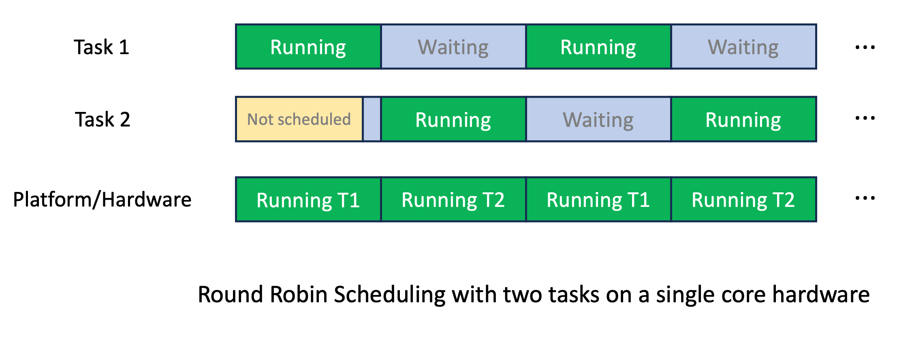
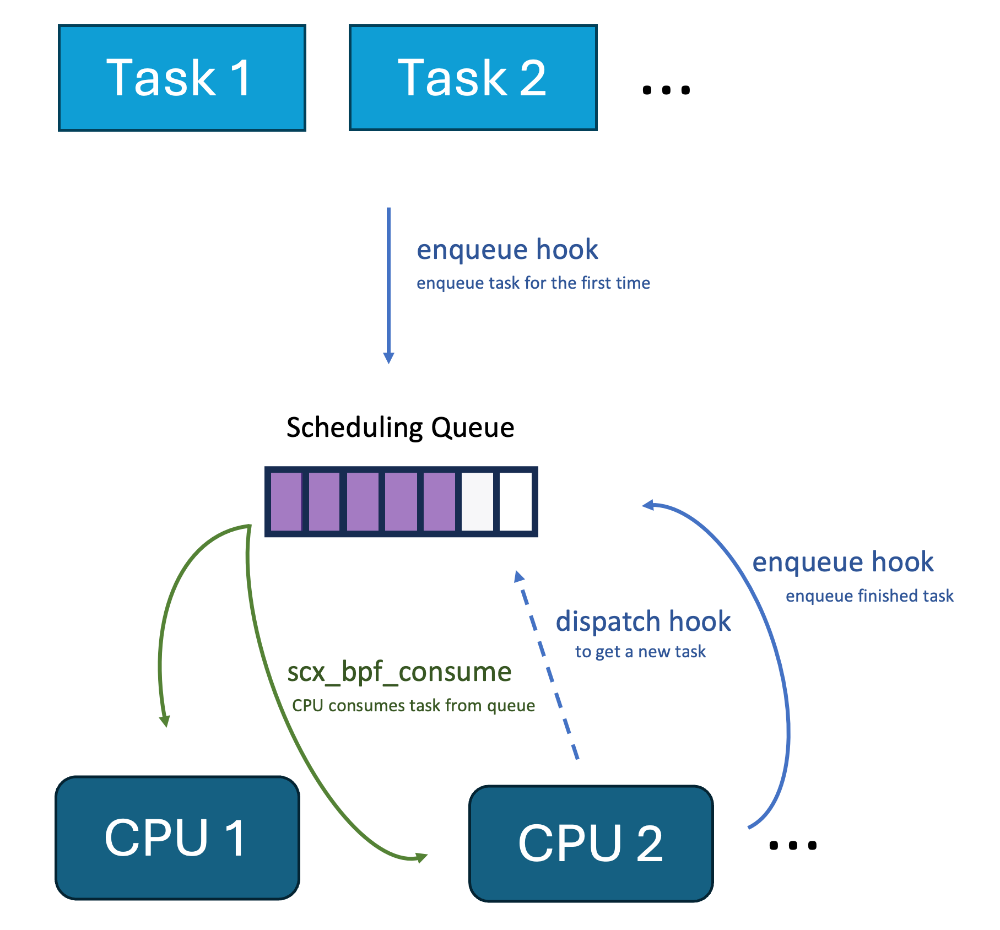

Minimal Scheduler
=================

This is a minimal scheduler written with sched-ext in C. 
This scheduler uses a global scheduling queue from which 
every CPU gets its tasks to run for a certain time slice. 
The scheduler order is First-In-First-Out. So it essentially implements a [round-robin scheduler](https://en.wikipedia.org/wiki/Round-robin_scheduling):



This just covers the basics, to learn more, look no further than the [scx wiki](https://github.com/sched-ext/scx/wiki).

Requirements
------------
This scheduler needs a 6.12 kernel, or a patched 6.11 kernel.
You can get a kernel patched with the scheduler extensions on Ubuntu 24.10 from 
[here](https://launchpad.net/~arighi/+archive/ubuntu/sched-ext-unstable),
or you run [CachyOS](https://cachyos.org/) and install a patched kernel from there.

Furthermore more you also need
- a recent `clang` for compilation
- `bpftool` for attaching the scheduler 

On Ubuntu you can run: `apt install clang linux-tools-common linux-tools-$(uname -r)`

Nothing more is needed to run it.

Usage
-----

In short, only two steps and you can use the scheduler: 

```bash
# build the scheduler binary
./build.sh

# start the scheduler
sudo ./start.sh

# do something ...

# stop the scheduler
sudo ./stop.sh
```

The Scheduler
-------------

The scheduler code only depends on the Linux bpf kernel headers and sched-ext. So here is the code from [sched_ext.bpf.c](./sched_ext.bpf.c):

```c
#include <vmlinux.h>
#include <bpf/bpf_helpers.h>
#include <bpf/bpf_tracing.h>

// Define a shared Dispatch Queue (DSQ) ID
#define SHARED_DSQ_ID 0

#define BPF_STRUCT_OPS(name, args...)	\
    SEC("struct_ops/"#name)	BPF_PROG(name, ##args)

#define BPF_STRUCT_OPS_SLEEPABLE(name, args...)	\
    SEC("struct_ops.s/"#name)							      \
    BPF_PROG(name, ##args)

// Initialize the scheduler by creating a shared dispatch queue (DSQ)
s32 BPF_STRUCT_OPS_SLEEPABLE(sched_init) {
    return scx_bpf_create_dsq(SHARED_DSQ_ID, -1);
}

// Enqueue a task to the shared DSQ, dispatching it with a time slice
int BPF_STRUCT_OPS(sched_enqueue, struct task_struct *p, u64 enq_flags) {
    // Calculate the time slice for the task based on the number of tasks in the queue
    // This is makes the system slightly more responsive than a basic round-robin
    // scheduler which assigns every task the same time slice all the time
    // The base time slice is 5_000_000ns or 5ms
    u64 slice = 5000000u / scx_bpf_dsq_nr_queued(SHARED_DSQ_ID);
    scx_bpf_dispatch(p, SHARED_DSQ_ID, slice, enq_flags);
    return 0;
}

// Dispatch a task from the shared DSQ to a CPU
int BPF_STRUCT_OPS(sched_dispatch, s32 cpu, struct task_struct *prev) {
    scx_bpf_consume(SHARED_DSQ_ID);
    return 0;
}

// Define the main scheduler operations structure (sched_ops)
SEC(".struct_ops.link")
struct sched_ext_ops sched_ops = {
    .enqueue   = (void *)sched_enqueue,
    .dispatch  = (void *)sched_dispatch,
    .init      = (void *)sched_init,
    .flags     = SCX_OPS_ENQ_LAST | SCX_OPS_KEEP_BUILTIN_IDLE,
    .name      = "minimal_scheduler"
};

// All schedulers have to be GPLv2 licensed
char _license[] SEC("license") = "GPL";
```

We can visualize the interaction of all methods in the scheduler with the following diagram:



Run the [`build.sh`](./build.sh) script to generate the `vmlinux.h` BPF header
and then compile the scheduler code to BPF bytecode:

```bash
bpftool btf dump file /sys/kernel/btf/vmlinux format c > vmlinux.h
clang -target bpf -g -O2 -c sched_ext.bpf.c -o sched_ext.bpf.o -I. 
```

Then run the [`start.sh`](./start.sh) script as a root user to attach the scheduler using the `bpftool`:
```bash
bpftool struct_ops register sched_ext.bpf.o /sys/fs/bpf/sched_ext
```

The custom scheduler is now the scheduler of this system. You can check this
by accessing the `/sys/kernel/sched_ext/root/ops` file:

```bash
> cat /sys/kernel/sched_ext/root/ops
minimal_scheduler
```

And by checking `dmesg | tail`:

```bash
> sudo dmesg | tail
# ...
[32490.366637] sched_ext: BPF scheduler "minimal_scheduler" enabled
```

Play around with your system and see how it behaves.
If you're done, you can detach the scheduler by running the [`stop.sh`](./stop.sh) script
using root priviledges. This removes the `/sys/fs/bpf/sched_ext/sched_ops` file.

Tasks for the Reader
--------------------

Now that you know how a basic scheduler looks like, you can start modifying it.
Here are a few suggestions:

### Vary the Time Slice
How does your system behave when you increase or decrease the time slice?

Try for example a time slice of 1s. Do you see any difference of how your cursor moves?
Or try a small time slice of 100us and run a program like that does some computation, 
do you see a difference in its performance?

### Limit the used CPUs
How does your system behave if the scheduler only schedules to specific CPUs?

Try for example to make your system effectively single core by only consuming task
on CPU 0 in `sched_dispatch` (Hint: the `cpu` parameter is the CPU id).

### Create multiple Scheduling Queues
How does your system behave with multiple scheduling queues for different
CPUs and processes?

Try for example to create two scheduling queues, with one scheduling queue only
for a process with a specific id (Hint: `task_struct#tgid` gives you the process id)
which is scheduled on half of your CPUs.

To do even more, you can look at the collected resources in the [scx wiki](https://github.com/sched-ext/scx/wiki),
especially the well documented [sched-ext code in the kernel](https://github.com/torvalds/linux/blob/master/kernel/sched/ext.c).

License
-------
GPLv2
